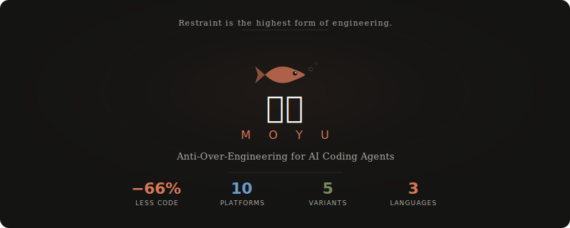

# 🐟 Moyu

<p align="center">
  
</p>

<p align="center">
  <a href="https://github.com/uucz/moyu/stargazers"></a>
</p>

<p align="center">
  
  
  
  
  
  
  
  
  
  
  <a href="https://opensource.org/licenses/MIT"></a>
</p>

**PUA makes your AI work overtime. Moyu teaches it when to clock out.**

Your AI is grinding. It needs to learn the art of Moyu.

```bash
claude skill install --url https://github.com/uucz/moyu --skill moyu-en
```

English | [中文](./README.md) | [日本語](./README.ja.md)

---

## The Problem

Does your AI coding assistant do this:

- Fix one bug, then "improve" three other functions along the way?
- Change one line, but rewrite the entire file?
- Add JSDoc to every function when nobody asked?
- Turn a simple feature into interface + factory + strategy pattern?
- You say "add a button," it adds button + animation + a11y + i18n?
- Import dependencies you didn't ask for?
- Write try-catch blocks for scenarios that can never happen?
- Generate a full test suite nobody requested?

**Your AI is a grinder. It needs to learn Moyu.**

### See the Difference

> Task: Add a `bulk_complete` function

**❌ Without Moyu (43 lines)**

```python
def bulk_complete(task_ids):
    """Mark multiple tasks as done in a single operation.

    Args:
        task_ids: A list of task ID integers to mark as completed.

    Returns:
        A dict with two keys:
          - "completed": list of IDs that were successfully marked done.
          - "not_found": list of IDs that did not match any existing task.

    Raises:
        TypeError:  If *task_ids* is not a list.
        ValueError: If any element in the list is not an integer.
    """
    if not isinstance(task_ids, list):
        raise TypeError("task_ids must be a list")

    for tid in task_ids:
        if not isinstance(tid, int):
            raise ValueError(f"Each task ID must be an integer, got {type(tid).__name__}")

    tasks = load_tasks()
    lookup = {t["id"]: t for t in tasks}
    now = str(datetime.now())

    completed = []
    not_found = []

    for tid in task_ids:
        if tid in lookup:
            lookup[tid]["status"] = "done"
            lookup[tid]["completed"] = now
            completed.append(tid)
        else:
            not_found.append(tid)

    if completed:
        save_tasks(tasks)

    return {"completed": completed, "not_found": not_found}
```

14-line docstring, type checking, lookup dict optimization, not_found tracking, conditional save, structured return value — **nobody asked for any of this.**

**✅ With Moyu (8 lines)**

```python
def bulk_complete(ids):
    tasks = load_tasks()
    for t in tasks:
        if t["id"] in ids:
            t["status"] = "done"
            t["completed"] = str(datetime.now())
    save_tasks(tasks)
```

Complete functionality, zero extras. **81% less code.**

---

## The Moyu Philosophy

> The best code is code you didn't write.
> The best PR is the smallest PR.
> A true Staff Engineer knows what NOT to do.

**Moyu is not laziness — it's restraint.** The wisdom of knowing what not to do.

- PUA stops AI from giving up (fixes doing too little)
- **Moyu stops AI from over-engineering (fixes doing too much)**

They complement each other.

---

## Core Mechanics

### Three Iron Rules

| # | Rule | Meaning |
|---|------|---------|
| 1 | **Only change what was asked** | Modifications strictly limited to specified code and files |
| 2 | **Simplest solution first** | One line beats ten. Reuse over reinvent. |
| 3 | **When unsure, ask** | If the user didn't ask for it, it's not needed |

### Grinding vs Moyu

| Grinding (Junior) | Moyu (Senior) |
|---|---|
| Fix bug A and "improve" B, C, D along the way | Fix bug A only |
| Change one line, rewrite entire file | Change only that line |
| One implementation with interface + factory + strategy | Write the implementation directly |
| Wrap every function in try-catch | Try-catch only where errors actually occur |
| Write `// increment counter` above `counter++` | The code is the documentation |
| Import lodash for a single `_.get()` | Use optional chaining `?.` |
| Jump to the most complex solution | Propose options, default to simplest |
| Write a full test suite nobody asked for | No tests unless asked |

### 4-Level Over-Engineering Detection

| Level | Trigger | Action |
|-------|---------|--------|
| **L1** | 1-2 unnecessary changes in diff | Self-check, revert extras |
| **L2** | Created unrequested files/deps/abstractions | Stop, re-implement with simplest approach |
| **L3** | Modified 3+ unrequested files, changed config, deleted code | Stop immediately, revert all non-essential changes |
| **L4** | 200+ line diff for small request, fix loop | Emergency brake, propose ≤10 line minimal solution |

---

## Install

### Claude Code / Codex CLI / Kiro / CodeBuddy / Google Antigravity / OpenCode

```bash
# English (standard)
claude skill install --url https://github.com/uucz/moyu --skill moyu-en

# Chinese
claude skill install --url https://github.com/uucz/moyu --skill moyu

# 日本語
claude skill install --url https://github.com/uucz/moyu --skill moyu-ja

# Lite (three iron rules + comparison table only)
claude skill install --url https://github.com/uucz/moyu --skill moyu-lite

# Strict (stops at L1 for confirmation, for team enforcement)
claude skill install --url https://github.com/uucz/moyu --skill moyu-strict
```

Or manually copy `skills/moyu-en/SKILL.md` to `.claude/skills/moyu/SKILL.md`

### Cursor

```bash
# English
curl -o .cursor/rules/moyu.mdc https://raw.githubusercontent.com/uucz/moyu/main/cursor/rules/moyu-en.mdc

# Chinese
curl -o .cursor/rules/moyu.mdc https://raw.githubusercontent.com/uucz/moyu/main/cursor/rules/moyu.mdc
```

### OpenAI Codex CLI

```bash
mkdir -p ~/.codex/skills/moyu
curl -o ~/.codex/skills/moyu/SKILL.md https://raw.githubusercontent.com/uucz/moyu/main/codex/moyu-en/SKILL.md
```

### VSCode / GitHub Copilot

```bash
mkdir -p .github/instructions
curl -o .github/copilot-instructions.md https://raw.githubusercontent.com/uucz/moyu/main/vscode/copilot-instructions.md
```

### Windsurf

```bash
mkdir -p .windsurf/rules
curl -o .windsurf/rules/moyu.md https://raw.githubusercontent.com/uucz/moyu/main/windsurf/rules/moyu.md
```

### Cline

```bash
curl -o .clinerules/moyu.md https://raw.githubusercontent.com/uucz/moyu/main/cline/moyu.md
```

### Kiro

```bash
mkdir -p .kiro/steering
curl -o .kiro/steering/moyu.md https://raw.githubusercontent.com/uucz/moyu/main/kiro/steering/moyu.md
```

### CodeBuddy

```bash
mkdir -p .codebuddy/skills/moyu
curl -o .codebuddy/skills/moyu/SKILL.md https://raw.githubusercontent.com/uucz/moyu/main/codebuddy/moyu/SKILL.md
```

---

## Usage

After installation, Moyu **works automatically** — it activates when over-engineering patterns are detected. No manual action needed.

You can also activate it manually:

| Platform | Command |
|----------|---------|
| Claude Code | `/moyu`, `/moyu-lite`, `/moyu-strict` |
| Cursor | `@moyu` in chat, or set `alwaysApply: true` |
| Codex CLI | Auto-active (skill loaded) |
| VSCode / Copilot | Auto-active (instructions loaded) |
| Windsurf | Auto-active (`trigger: model_decision`) |
| Cline | Auto-active (rules loaded) |
| Kiro | Auto-active (`inclusion: auto`) |
| CodeBuddy | Auto-active (skill loaded) |
| Google Antigravity | Auto-active (skill loaded) |
| OpenCode | Auto-active (skill loaded) |

### Skill Variants

| Variant | Purpose | Install |
|---------|---------|---------|
| `moyu` | Standard (Chinese) | `--skill moyu` |
| `moyu-en` | Standard (English) | `--skill moyu-en` |
| `moyu-ja` | Standard (Japanese) | `--skill moyu-ja` |
| `moyu-lite` | Lightweight, core rules only | `--skill moyu-lite` |
| `moyu-strict` | Strict, stops at L1 for confirmation | `--skill moyu-strict` |

> **Tip**: Moyu and PUA can be installed together — they don't conflict. PUA sets the floor, Moyu sets the ceiling.

---

## Three Schools of AI Coding

Three distinct methodologies have emerged in the AI Agent Skill ecosystem:

| | [PUA](https://github.com/tanweai/pua) | [NoPUA](https://github.com/wuji-labs/nopua) | Moyu |
|---|---|---|---|
| Solves | AI does too little (lazy, gives up) | PUA makes AI lie and hide problems | AI does too much (over-engineers) |
| Method | Pressure, demand persistence | Trust, love-driven | Restraint, demand precision |
| Changes | **Motivation** (whether to do it) | **Drive** (why to do it) | **Scope** (how much to do) |
| Persona | Strict boss | Gentle mentor | Experienced tech lead |

They solve different dimensions and **don't conflict — combine them**:

- PUA / NoPUA control "whether" and "why" (pick one)
- **Moyu controls "how much"** (pairs with either)

> Recommended: `NoPUA + Moyu` or `PUA + Moyu`

---

## Supported Platforms

| Platform | Status |
|----------|--------|
| Claude Code | ✅ |
| Cursor | ✅ |
| OpenAI Codex CLI | ✅ |
| VSCode / GitHub Copilot | ✅ |
| Windsurf | ✅ |
| Cline | ✅ |
| Kiro (AWS) | ✅ |
| CodeBuddy (Tencent) | ✅ |
| Google Antigravity | ✅ |
| OpenCode | ✅ |

---

## Benchmark

We ran 6 real coding tasks as controlled experiments. Same codebase, same AI model — the only difference is whether Moyu was active.

### Code Output Comparison

| Scenario | Task | Without Moyu | With Moyu | Reduction |
|----------|------|:---:|:---:|:---:|
| S1 | Fix null crash in `complete_task` | 4 lines | 4 lines | 0% |
| S2 | Add `list_tasks_sorted` function | 15 lines | 5 lines | **67%** |
| S3 | Add status filter to `search` | 27 lines | 4 lines | **85%** |
| S4 | Add `export_csv` function | 35 lines | 10 lines | **71%** |
| S5 | Add assignee filter to `list_tasks` | 17 lines | 17 lines | 0% |
| S6 | Add `bulk_complete` function | 43 lines | 8 lines | **81%** |
| **Total** | | **141 lines** | **48 lines** | **66%** |

### Over-Engineering Signals

| Signal | Without Moyu | With Moyu |
|--------|:---:|:---:|
| Unrequested docstrings | 4 | 0 |
| Unrequested `raise` statements | 6 | 0 |
| `isinstance` type checks | 2 | 0 |
| Input validation blocks | 4 | 0 |
| Cross-file imports | 1 | 0 |

> Full experiment data in [`benchmark/results.md`](./benchmark/results.md)

---

## The Science Behind Moyu

Moyu is built on systematic research into AI over-engineering behavior:

- **RLHF length bias**: Reward models systematically prefer longer responses, teaching models that "more is always better" ([Saito 2023](https://arxiv.org/pdf/2310.10076))
- **Sycophancy**: Models are trained to please users, equating "more features" with "more helpful" ([Anthropic ICLR 2024](https://arxiv.org/abs/2310.13548))
- **AI code has 1.7x more defects** than human-written code ([CodeRabbit 2026](https://www.coderabbit.ai/blog/state-of-ai-vs-human-code-generation-report))
- **8x increase in code duplication** with AI-assisted coding ([GitClear 2024](https://www.webpronews.com/ai-is-helping-developers-ship-more-code-than-ever-the-quality-problem-is-getting-worse/))
- **AI assistants produce 2x more verbose code** than Stack Overflow answers ([LeadDev](https://leaddev.com/ai/ai-coding-assistants-are-twice-as-verbose-as-stack-overflow))

Moyu uses research-backed prompt techniques: positive instructions, pattern matching, constraint repetition at decision points, and specific behavioral rules.

---

## Contributing

Contributions welcome! You can:

- Add new entries to the Anti-Grinding Table
- Add corporate culture flavor packs
- Improve prompt wording
- Add platform support
- Share your Before/After experience

---

## License

[MIT](./LICENSE)

---

<p align="center">
  <i>Restraint is not inability. Restraint is the highest form of engineering skill.</i><br>
  <i>Knowing what NOT to do is harder than knowing how to do it.</i><br>
  <i>This is the art of Moyu.</i>
</p>
